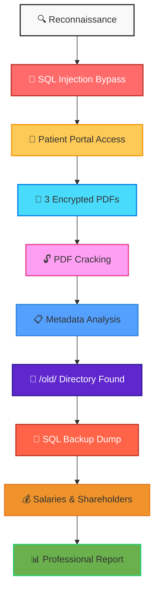

# 🏥 Mediroza General Hospital – Penetration Test

<p align="center">
  
  
  
  
</p>

## Networkwalks Internship – Week 4 Project

**Candidate:** Pradheepa.M  
**Internship Batch:** AUG26 Batch B082  
**Date:** September 2026  
**Environment:** Kali Linux 2026.2 (VirtualBox) / Windows 11 Host

---

## 📋 Executive Summary
A comprehensive **3-day black-box penetration test** was conducted against the simulated healthcare infrastructure of **Mediroza General Hospital**. The engagement successfully emulated a real-world adversary, compromising the application via a **SQL Injection** chain, bypassing authentication, and exfiltrating sensitive medical and financial data.

The assessment resulted in the extraction of **3 confidential patient pathology reports**, **30 employee payroll records**, and **10 shareholder agreements**. 

**Overall Risk Posture:** 🔴 **CRITICAL**

---

## 🧬 Attack Chain & Methodology

The testing followed a structured offensive security methodology to demonstrate the full impact of the discovered vulnerabilities.


---

## 🔥 Key Findings & Data Exposure

| Identifier | Vulnerability | Severity | Exploit Result |
| :--- | :--- | :--- | :--- |
| **F-001** | **SQL Injection** (Boolean-Based) | 🔴 **Critical** | Admin login bypass using `admin' -- ` |
| **F-002** | **Weak Cryptographic Storage** (PDF) | 🟠 **High** | Decrypted 3 patient files with `rockyou.txt` |
| **F-003** | **Directory Listing & Data Leak** | 🔴 **Critical** | Exposed `mediroza_db_backup_2019.sql` |

### 📂 Exposed Data Breakdown

**1. Patient Medical Records**
- **Sipho Dlamini** (MG-P-10231) - Abnormal White Cell Count.
- **Priya Reddy** (MG-P-10244) - High Cholesterol & Triglycerides.
- **Emily Thompson** (MG-P-10258) - Iron Deficiency (Low Ferritin & Vitamin D).

**2. Hospital Payroll (30 Employees)**
> *The `staff` table exposed monthly salaries in ZAR. The highest salary was R160,000 (Medical Director), and the lowest was R19,000 (Receptionist).*

**3. Shareholder Structure**
> *Dr. Rajesh Naidoo holds a 18.0% majority stake, while Dr. Vikram Chetty holds a 4.0% Preferential share class.*

---

## 🛠️ Arsenal (Tools Used)

| Tool | Purpose | Status |
| :--- | :--- | :--- |
| **Gobuster** | Directory Enumeration & Fuzzing | ✅ |
| **Burp Suite** | Request Interception & Repeater | ✅ |
| **Manual SQLi** | Authentication Bypass (`admin' -- `) | ✅ |
| **pdfcrack** | Password Recovery (Rockyou.txt) | ✅ |
| **exiftool** | Metadata Extraction & Analysis | ✅ |
| **wget / grep** | Remote File Retrieval & Parsing | ✅ |
| **PowerShell** | Evidence Organization & Renaming | ✅ |

---

## 📁 Repository Structure

This repository is meticulously organized to mirror the 4 Milestones of the engagement.

```
Networkwalks_Internship_week4/
├── 📁 M1_Discovery/                 # Milestone 1: Reconnaissance & Breach
│   └── 📁 Screenshots/
│       ├── 01_Terminal_Setup.png
│       ├── 02_SQL_Injection_Payload.png
│       └── 11_Authenticated_Portal.png
├── 📁 M2_Cracking/                  # Milestone 2: Decryption
│   └── 📁 Screenshots/
│       ├── 12_Emily_Thompson_Report.png
│       ├── 18_PDFCrack_Recovering.png
│       └── ...
├── 📁 M3_Server_Access/             # Milestone 3: Lateral Movement & Exfil
│   └── 📁 Screenshots/
│       ├── 20_Old_Directory_Listing.png
│       ├── 23_SQL_Staff_Table.png
│       └── 24_SQL_Shareholders.png
├── 📄 Mediroza_Penetration_Test_Report_Pradheepa_M.pdf   # Final Deliverable
├── 📄 backup.sql                                            # Exposed Database Dump
└── 📄 README.md                                             # You are here!
```

---

## 📷 Visual Evidence Highlights

A total of **24 high-quality screenshots** are included in the `M1`, `M2`, and `M3` folders, documenting every successful step.

*Example: SQL Injection Bypass showing `admin' -- ` in the username field.*


---

## 📄 Full Penetration Test Report

The complete, comprehensive report is available below:

📄 **[Mediroza_Penetration_Test_Report_Pradheepa_M.pdf](./Mediroza_Penetration_Test_Report_Pradheepa_M.pdf)**

> *This report contains detailed findings, exploitation steps, remediation recommendations, and a full breakdown of all discovered vulnerabilities.*

---

## ⚠️ Ethical & Legal Disclaimer

> **IMPORTANT**
> This project was conducted **strictly for educational purposes** as part of the **Networkwalks Internship Program (Batch B082 | Week 4)**. 
> The target environment (`https://medirozahospital.com`) is a **simulated training lab** designed explicitly for cybersecurity education. **Written authorization** was granted by the training provider prior to testing.
> 
> The techniques and code demonstrated in this repository must **never** be applied to any system, network, or application without obtaining **explicit, written permission** from the rightful owner. Unauthorized access is illegal and unethical.

---

## 👨‍💻 Author

**Pradheepa M**  
🔹 Networkwalks Intern – Batch B082  
🔹 [GitHub Profile](https://github.com/pradheepa73)  
🔹 [LinkedIn](https://www.linkedin.com/in/pradheepa-m-051728372)

*Feel free to connect or reach out for collaborations on offensive security research!*

---

## ⭐ Project Status

| Milestone | Objective | Status |
| :--- | :--- | :--- |
| M1 | Breach & Retrieve 3 PDFs | ✅ Complete |
| M2 | Crack Encryption & Extract Text | ✅ Complete |
| M3 | Find Salaries & Shareholders | ✅ Complete |
| M4 | Compile Professional Report | ✅ Complete |
| Final | Portfolio & GitHub Documentation | ✅ Complete |

---

<p align="center">
  <b>© 2026 Networkwalks Internship Program. All rights reserved.</b>
</p>
```

---
